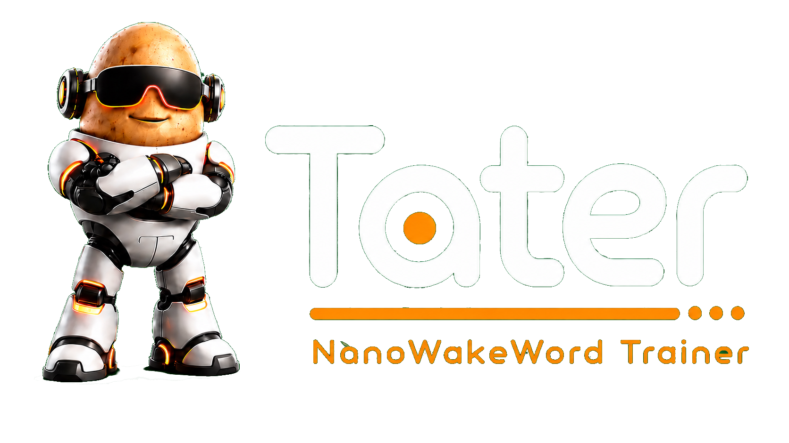

<div align="center">
  <a href="https://taterassistant.com">
    
  </a>
</div>
<h3 align="center">
  <a href="https://taterassistant.com">taterassistant.com</a>
</h3>

# Tater NanoWakeWord Trainer

A small web trainer for building NanoWakeWord models that Tater satellites can use through Tater's remote NanoWakeWord server.

The app follows the same basic contract as the Tater openWakeWord trainer:

- upload positive wake clips
- upload negative clips
- accept captured raw audio from firmware
- start a training job
- stream logs in the browser
- expose trained artifacts from `/api/artifacts`

Tater can load this trainer from the **Voice Models -> NanoWakeWord Trainer** panel.

## Run Locally

```bash
./run.sh
```

Default URL:

```text
http://127.0.0.1:8792
```

## Train

Open the UI, enter a wake phrase, upload some positive/negative audio if you have it, then start training.

The normal training run uses the higher-quality NanoWakeWord recipe by default:

- 2,500 synthetic positive samples
- 5,000 synthetic adversarial negative samples
- 3,000 phoneme hard-negative samples
- 2,000 validation positive/negative samples
- stronger augmentation and validation-aware training defaults
- `num_workers=0` by default for better stability in Docker/GPU runs

If these Colab-style negative feature banks are present in `feature_banks/`, they are automatically included as extra negative sources:

```text
AE29H_float32.npy
RACON_11h_v1.npy
openwakeword_features_ACAV100M_2000_hrs_16bit.npy
```

When changing sample counts, background/RIR clips, or validation settings for an existing wake phrase, enable **Regenerate feature files** in the UI or pass `--overwrite` on the CLI so NanoWakeWord does not reuse stale `.npy` feature files.

For early real-room tests, add false wakes and normal room audio to `negative_samples/` before retraining. Pure synthetic data can pass training loss while still false-triggering on satellite microphone audio.

The trainer writes generated configs and model outputs under:

```text
output/
trained_wake_words/
```

Tater reads available model artifacts from:

```text
/api/artifacts
```

Supported exported model extensions:

```text
.onnx
.pt
.pth
```

## Docker

```bash
docker build -f dockerfile -t tater-nanowakeword-trainer .
docker run --rm -it -p 8792:8792 -v "$PWD:/data" tater-nanowakeword-trainer
```

NVIDIA build:

```bash
docker build -f Dockerfile.nvidia -t tater-nanowakeword-trainer:nvidia .
docker run --rm -it --gpus all -p 8792:8792 -v "$PWD:/data" tater-nanowakeword-trainer:nvidia
```

The GitHub workflow publishes the NVIDIA image to:

```text
ghcr.io/tatertotterson/nanowakeword-trainer:nvidia
```

## Notes

NanoWakeWord currently does not have a broad public pretrained wake-word catalog like openWakeWord, so this trainer is the intended path for custom wake words.
